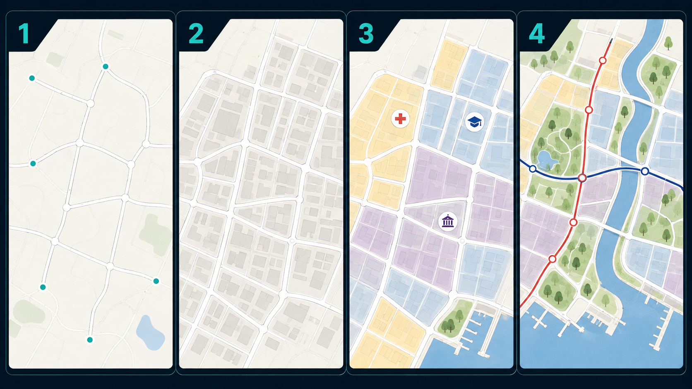
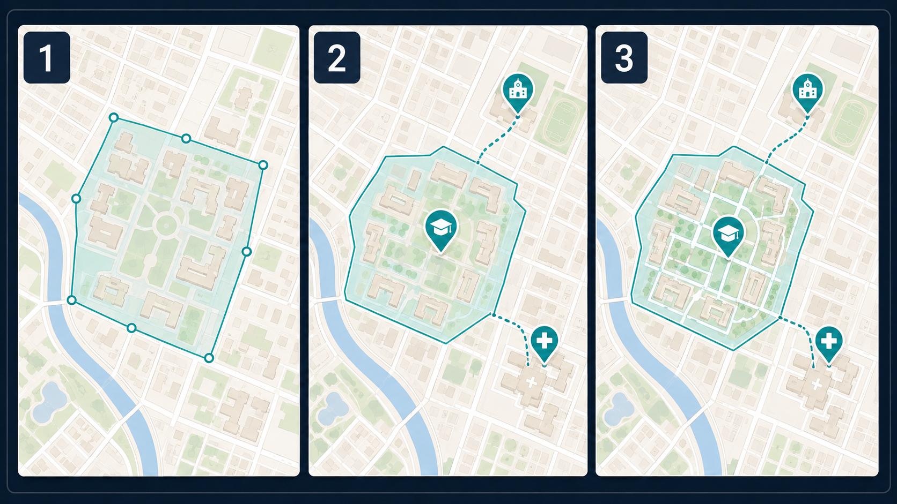

# CityGraph

<p align="center">
  
</p>

<p align="center"><strong>在一张无限画布上，画出你想象中的城市。</strong></p>

CityGraph 是一款中文友好的二维城市地图创作器。道路、街区、建筑、功能分区、公共设施、公交、水域和大学都可以直接绘制与编辑，无需学习 GIS 软件。



## 立即开始

需要 [Node.js 20.19+](https://nodejs.org/) 和 npm。

```powershell
git clone https://github.com/zihayi/CityGraph.git
cd CityGraph
npm install
npm run dev
```

浏览器打开 <http://127.0.0.1:5173>。进入后可以先在示例城市上尝试工具，也可以点击右上角 **设置 → 新建地图** 从空白地图开始。

桌面版开发运行还需要安装 [Rust](https://www.rust-lang.org/tools/install)：

```powershell
npm run tauri:dev
```

## 第一张地图

1. **画道路**：选择左侧“道路”，依次点击起点和终点；继续点击可以连续绘制，按 `Esc` 结束。
2. **生成街区**：选择“街区”，设置行列数，在地图上点击两个对角点。
3. **放置建筑**：选择“建筑”，挑选轮廓与用途，靠近道路点击即可自动对齐。
4. **添加分区**：选择“分区 → 填充道路区域”，再点击道路围合区域；也可以逐点画出任意轮廓。
5. **丰富城市**：加入公园、水域、公交和公共设施。设施包括医院、剧院、体验馆、博物馆、商店等。
6. **保存作品**：点击顶部“保存”。新建、另存为、加载和自动保存位于“设置”中。

绘制多边形时按 `Enter` 或双击完成，按 `Esc` 取消。滚轮缩放，中键拖动旋转；地图处于拖动工具时可用左键平移。

## 大学校区



1. 选择左侧“大学 → 大学分区”，画出首个校区。
2. 在右侧创建大学并填写名称、类型、校徽、简介和 Tag。
3. 在大学详情中添加附属学校、附属医院或附属设施，然后直接到地图上点击目标完成关联。

大学还可以拥有多个校区，并在每个校区内放置学院、实验室、图书馆、宿舍、食堂、体育馆等设施。

## 常用操作

| 操作 | 方法 |
| --- | --- |
| 选择与查看属性 | 使用左侧“选择”，点击地图对象 |
| 完成自由轮廓 | `Enter` 或双击 |
| 取消当前绘制 | `Esc` |
| 删除选中对象 | `Delete` 或 `Backspace` |
| 撤销 / 重做 | 顶部按钮 |
| 缩放 | 鼠标滚轮 |
| 旋转 | 中键拖动 |
| 全屏 | `Alt + Enter` |
| 中英文切换 | 设置 → 界面 → 语言 |

## 已有内容

- 直线、曲线、平行、圆形和多边形道路，以及平交、高架、隧道
- 参数化街区和矩形、L/U/H 形、庭院式、自由轮廓建筑
- 住宅、商业、教育、医疗、工业、办公、绿地和自定义分区
- 公交环线、站点和沿道路自动寻路
- 自由轮廓与随机矩形湖泊
- 公共设施、大学校区和附属单位关系
- 图层控制、对象属性编辑、吸色器、撤销与重做
- 本地存档、自动保存、中文和英文界面

CityGraph 目前是创意建造工具，不包含人口、经济、交通流量或任务模拟。

## 开发与构建

```powershell
npm test
npm run build
npm run tauri:build
```

Windows 安装包生成到 `src-tauri/target/release/bundle/`。

技术栈：React 19、TypeScript、PixiJS、Zustand、Vite、Vitest、Tauri 2。
